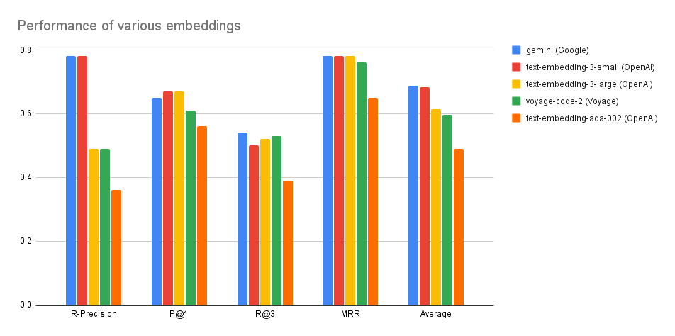
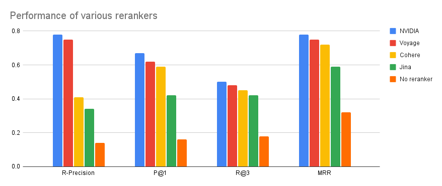
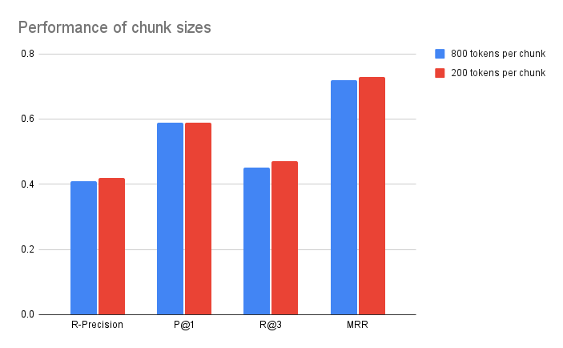

# Chat-with-your-codebase: Retrieval Benchmark
When using this repository (which allows you to chat with your codebase in two commands), you are indirectly making a series of choices that greatly influence the quality of your AI copilot: chunking strategy, embeddings, retrieval algorithm, rerankers, etc.

Our role as maintainers is two-fold: to give you options/flexibility, but also to find good defaults. We're not here just to dump code on the Internet. We're here to *make it work*.

To make progress, we need a ladder to climb. That's why we partnered with our friends at [Morph Labs](https://morph.so) to produce a benchmark that will allow us to make informed decisions and measure progress. We will make it public soon, but if you really really can't wait, let us know at [founders@storia.ai](mailto:founders@storia.ai).

Here you will find our first learnings enabled by this dataset. We focused on proprietary APIs, but we're planning on extending experiments to open-source models as well.

#### TL;DR
- OpenAI's `text-embedding-3-small` embeddings perform best.
- NVIDIA's reranker outperforms Cohere, Voyage and Jina.
- Sparse retrieval (e.g. BM25) is actively hurting code retrieval if you have natural language files in your index (e.g. Markdown).
- Chunks of size 800 are ideal; going smaller very has marginal gains.

And now, if you want to nerd out, here's a bunch of plots and stats.

## Dataset
Our dataset consists of 1,000 `<question, answer, relevant_documents>` pairs that focus on Hugging Face's [Transformers](https://github.com/huggingface/transformers) library.

The dataset was generated artificially and checked for quality by humans (we collaborated with [Morph Labs](https://morph.so)). The questions were designed to require context from 1-3 different Python files in order to be answered correctly.

A sample of 10 instances is provided in [sample.json](sample.json).

### Code Retrieval Benchmark
Here, we will be using `<question, relevant_documents>` pairs as a code retrieval benchmark. For instance:
```
- Question:
When developing a specialized model class in the Transformers library, how does `auto_class_update` ensure that the new class's methods are tailored specifically for its requirements while preserving the functionality of the original methods from the base class?

- Relevant documents:
huggingface/transformers/src/transformers/models/auto/auto_factory.py
huggingface/transformers/src/transformers/utils/doc.py
```

#### Why not use an already-established code retrieval benchmark?
Indeed, there are already comprehensive code retrieval benchmarks like [CoIR](https://arxiv.org/abs/2407.02883). In fact, the [CosQA](https://arxiv.org/abs/2105.13239) subset of this benchmark has a similar format to ours (text-to-code retrieval for web queries).

However, we designed our document space to be *an entire codebase*, as opposed to a set of isolated Python functions. A real-world codebase contains a variety of files, including ones that are distracting and get undeservedly selected by the retriever. For instance, dense retrievers tend to prefer short files. READMEs also tend to score high even when irrelevant, since they're written in natural language. Our benchmark is able to surface such behaviors. It also allows us to experiment with a variety of strategies like file chunking.

In the rest of this document, we'll be sharing a few initial learnings enabled by our benchmark.

## Embeddings
:classical_building: **Verdict**: Use OpenAI's `text-embedding-3-small` embeddings.

Today, most retrieval systems are *dense*. They pre-compute document *embeddings* and store them in an index. At inference time, queries are also mapped to the same embedding space. In this world, retrieval is equivalent to finding the nearest neighbors of the query embedding in the index.

To this end, the [MTEB leaderboard](https://huggingface.co/spaces/mteb/leaderboard) (Massive Text Embeddings Benchmark) offers a comprehensive comparison for open-source embeddings.

To complement this, we compared proprietary embedding APIs from [OpenAI](https://platform.openai.com/docs/guides/embeddings) and [Voyage](https://docs.voyageai.com/docs/embeddings). The main advantage of using these providers (in addition to quality) is that they provide *batch* embedding APIs, so you can get an entire repository indexed relatively quickly without the headache of hosting your own embedding models (you can do so with a simple `sage-index $GITHUB_REPO` command).



The plot above shows the performance of the three types of embeddings from OpenAI (`text-embedding-3-small`, `text-embedding-3-large`, `text-embedding-ada-002`) and the code-specific embeddings from Voyage (`voyage-code-2`).

#### Experiment settings

- File chunks of <= 800 tokens;
- Dense retriever (nearest neighbor according to cosine distance of embeddings);
- Retrieved `top_k=25`;
- Reranked documents using the [NVIDIA re-ranker](https://docs.nvidia.com/nim/nemo-retriever/text-reranking/latest/using-reranking.html) and selected `top_k=3`.

#### Results

- Across most evaluation metrics, OpenAI's `text-embedding-3-small` performs best.
- It's remarkable that the `text-embedding-3-large` embeddings don't perform better, despite having double the size (3072 vs 1536).
- The older `text-embedding-ada-002` embeddings are trailing last with a huge gap in performance, so this is your call to update your pipeline if you haven't already.

## Rerankers
:classical_building: **Verdict**: Use NVIDIA's reranker.

In a world with infinitely fast compute, we would perform retrieval by passing each `<query, document>` pair through a Transformer, allowing all the query tokens to attend to all the document tokens. However, this is prohibitively expensive.

In practice, all documents are embedded independently and stored in a vector database. Most retrieval systems are two-staged: (1) embed the query independently to find its top N nearest neighbor documents, and (2) re-encode all top N `<query, document>` pairs and select the top K scoring ones. The second stage is called *reranking*.



While the [MTEB leaderboard](https://huggingface.co/spaces/mteb/leaderboard) compares *open-source* embedding models based on their ability to rerank documents, we conducted experiments on the most popular *proprietary* APIs for reranking, including [NVIDIA](https://docs.nvidia.com/nim/nemo-retriever/text-reranking/latest/using-reranking.html), [Voyage](https://docs.voyageai.com/docs/reranker), [Cohere](https://cohere.com/rerank) and [Jina](https://jina.ai/reranker/).

#### Experiment settings
- File chunks of <= 800 tokens;
- Dense retriever using OpenAI's `text-embedding-3-small` model;
- Retrieved `top_k=25` documents;
- Reranked documents and selected `top_k=3`.

#### Results
- Across all evaluation metrics, the highest performing rerankers are, in this order: [NVIDIA](https://docs.nvidia.com/nim/nemo-retriever/text-reranking/latest/using-reranking.html), [Voyage](https://docs.voyageai.com/docs/reranker), [Cohere](https://cohere.com/rerank) and [Jina](https://jina.ai/reranker/).
- Not using a reranker at all completely tanks the performance.

## Retrieval: Sparse vs Dense
:classical_building: **Verdict**: Use fully dense embeddings.

So far, we've been experimenting with purely *dense* retrieval. That is, documents are selected solely on the cosine distance between their embedding and the query embedding.

Before the emergence of deep learning, retrievers used to be *sparse*. Such retrievers (e.g. [TF-IDF](https://en.wikipedia.org/wiki/Tf%E2%80%93idf) or [BM25](https://en.wikipedia.org/wiki/Okapi_BM25)) were based on vectors of word counts (the vector of a document has the length of the dictionary, with each entry showing how many times a token occurs in the document; the term *sparse* comes from the fact that most entries are 0).

Since sparse retrievers rely on exact string match, one might assume they come in handy when the query contains a relatively unique token (e.g. a class name) that occurs in a small number of documents.

At the intersection of dense and sparse retrievers, *hybrid* retrievers score documents by the weighted average of the dense and sparse scores.


In the experiment above, we compared the three types of retrievers (dense, hybrid and sparse).

#### Experiment settings
- File chunks of <= 800 tokens;
- For the dense and hybrid retrievers, we used OpenAI's `text-embedding-3-small` model for embeddings;
- Retrieved `top_k=25` documents;
- Reranked documents using the [NVIDIA re-ranker](https://docs.nvidia.com/nim/nemo-retriever/text-reranking/latest/using-reranking.html) and selected `top_k=3`.

#### Results
Somewhat surprisingly, sparse retrieval is actively hurting performance. The reason is that exact string matching will favor files that are in natural language (and therefore match the token distribution in the query).

The plot below shows what percentage of the retrieved files are in Markdown. The purely sparse retriever chooses a Markdown file 40% of the time! Remember that we designed our questions so that the required context are Python files. This doesn't preclude Markdown files from actually being helpful in answering some of the questions, but surely not to this degree.


## Chunk sizes
:classical_building: **Verdict**: 800 tokens per chunk works well

The [CodeRag paper](https://arxiv.org/pdf/2406.14497) suggests that the ideal chunk size is somewhere between 200-800 tokens. All our experiments above used 800 tokens per chunk. When experimenting with the other end of the spectrum, we saw very mild improvements from having smaller chunks. We believe that these marginal gains are not worth the increased indexing time (since we need to send 4x more queries to the batch embedding APIs).



## Disclaimer
Please take everything with a grain of salt. This is not a research paper (yet). If it was, you'd be reading it on arxiv. It's more of a rough guide that helps you binary-search your way into a good enough start. The road ahead is long!
